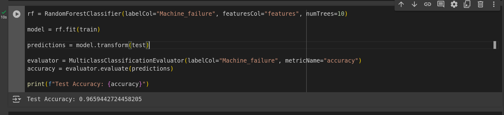
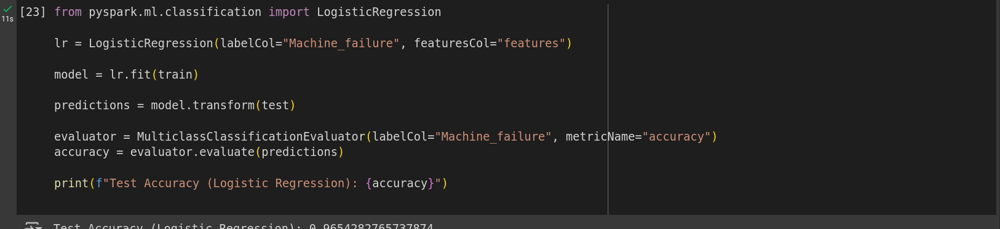

# Predictive Maintenance with Spark and MongoDB

This project uses Apache Spark and MongoDB to develop a predictive maintenance model for detecting equipment failures based on sensor data.

## Project Structure

- `spark_app.py`: The Spark application that builds the predictive model.
- `load_data.py`: The script to load sensor data into MongoDB.
- `sensor_data.csv`: The CSV file containing sensor data.
- `Dockerfile`: Docker setup for running Spark with MongoDB connector.
- `docker-compose.yml`: Docker Compose file to run Spark and MongoDB containers.

## Running the Project

1. Start MongoDB and Spark using Docker Compose:
    ```bash
    docker-compose up
    ```

2. Load data into MongoDB:
    ```bash
    docker run -it --network spark_mongo_network -v $(pwd):/app python:3.8-slim python /app/load_data.py
    ```

3. Run the Spark application:
    ```bash
    docker exec -it spark1 bash
    spark-submit /opt/bitnami/spark/app/spark_app.py
    ```


## Model Acuuracy



